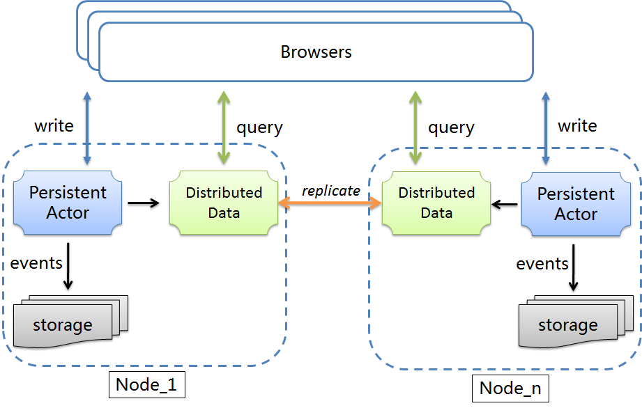
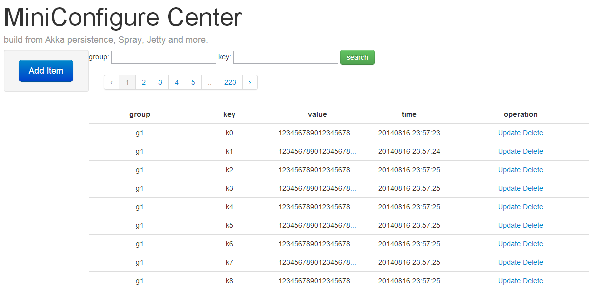
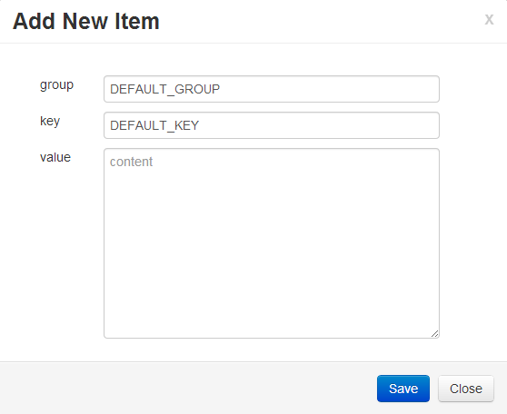

Mini Configuration Center
==================================

Overview
----------

Centralized configuration management, including online editing, persistence, especially the change of the configuration data can be perceived in runtime.

we use Spray / Akka persistence and using CQRS mode. thanks for Akka persistence, it make the source code number decreased dramatically,the core code number no more than 300 lines. 

a Configuration = Group  +  Key  +  Value

Mini Configuration Center(miniconf) consists of two parts: server side and client jar. 

- `server side` expose RESTful service(use Spray / embedded jetty) and use local leveldb to save Add/Edit/Query configuration event and view's snapshot.

- `client jar` provide scala and java interface.

Usage
-----------

### server side
you can download the server.zip, unzip it,in bin directory use 'miniconfServer.sh'(in linux) or 'miniconfServer.bat'(in windows),it will startup an embedded Jetty server(jdk1.7 is required).

### web page
- the main page url is http://your server ip:8810/ (the default port is 8810)

- Add/Edit One Configuration

###conf
in conf directory, you can edit application.conf for custom need.

Reference configuration
     
      akka {
         loggers = ["akka.event.slf4j.Slf4jLogger"]
         loglevel = "DEBUG"
         stdout-loglevel = "DEBUG"
         
         persistence
         {
 	       journal
 	       {
 	         leveldb
 	         {
 	           dir = "../target/journal"
 	           native = on
 	         }
 	       }
        
 	       snapshot-store
 	       {
 	         local
 		 		{
 		   		 dir = "../target/snapshots"
 				}
 	       }
         }
      }

      spray.servlet {
        boot-class = "miniconf.server.Boot"
        request-timeout = 6s
      }

      miniconf {
          jetty_server_port = 8810
      }  

Client jar
--------------
### Add One Configuration
		// create MiniConfClient instance
		val theMiniConfClient = new MiniConfClient("http://localhost:8810")
		// saveOneConfItem
		theMiniConfClient.saveOneConfItem("g2", "k1", "gv2")

### Get One Configuration
		val theMiniConfClient = new MiniConfClient("http://localhost:8810")
		theMiniConfClient.getOneConfItem("g2", "k1")

### Register Data modified Listener
		val theMiniConfClient = new MiniConfClient("http://localhost:8810")
		theMiniConfClient.registerListener("g2", "k1", {newValue => System.out.println("conf have modified "+newValue)})

License
--------------
This code is open source software licensed under the Apache 2.0 License.
